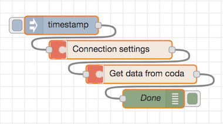
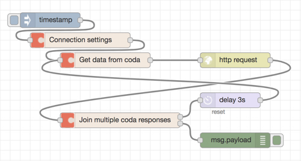
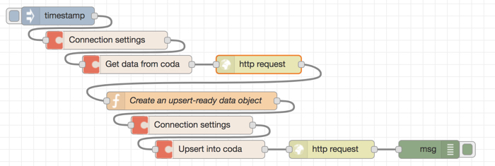

# Node-RED nodes for Coda

[Coda](https://coda.io/ "Coda") is a powerful online tool that allows you to build complex and interactive documents quickly.

With [Coda APIs](https://coda.io/developers/apis/v1beta1 "coda.io APIs"), you can interact with tables within Coda documents. The nodes included in this package allow you to easily work with Coda APIs using Node-RED.

**This package is compatible with Coda API version 0.1.1-beta**

## Content of this package and features

  - **Connection settings node**
    - Stores multiple Coda API tokens and table IDs/names (use of names is not recommended as names can change)
  - **Get data node**
    - This node constructs a URL and HTTP header to:
      - get a list of tables, folders and sections in a doc
      - get a list of columns from a table
      - get rows from a table
  - **Multiple pages node**
    - Sends multiple requests to Coda to retrieve a large number of rows from Coda (Coda allows you to retrieve up to 500 rows per GET request)
  - **Upsert node**
    - constructs a URL and HTTP header
    - format data into a structure that is accepted by Coda APIs

Please note: this package does not handle HTTP requests, but relies on the 'HTTP request' function node to handle it.

## How to get data from Coda
### Preparation
The node comes with fields to enter the following information:
  - Coda API authentication key
  - Document ID
  - Table ID/name (optional)

To find your document ID, use [this tool](https://coda.io/developers/apis/v1beta1#doc-ids).

### 1. Find out table IDs
(This step can be omitted if you use a table ID. However, it makes the system fragile as table names can change and therefore not recommended)
1. Connect an inject node to a **Coda connection settings** node. Add the document ID which the table you want to access is placed in
2. Connect it to a **get data** node, then select the 'Nothing' from the dropdown 'What to get from the table'
3. Connect it to an 'HTTP request' function node. Open the node, then select 'GET' in the 'Method' dropdown, as well as 'a parsed JSON object' for 'Return'
4. Output the message to a debug node. Coda's response is found in `msg.payload`
5. `msg.payload.items` is an array containing the information on all the tables found in the document. You can obtain the ID of the table you want to refer to. If the debug message gets cut off and you cannot see all the tables, simply increase the value of `debugMaxLength` in `settings.js`.



Here's an example of the flow:

```[{"id":"2505aded.ab29b2","type":"debug","z":"69eb5e38.bc12b","name":"","active":true,"tosidebar":true,"console":false,"tostatus":false,"complete":"true","x":250,"y":200,"wires":[]},{"id":"7c547c80.9444e4","type":"inject","z":"69eb5e38.bc12b","name":"","topic":"","payload":"","payloadType":"date","repeat":"","crontab":"","once":false,"onceDelay":0.1,"x":100,"y":40,"wires":[["b8a5b381.0c4a9"]]},{"id":"5d41bbb8.af3084","type":"http request","z":"69eb5e38.bc12b","name":"","method":"GET","ret":"obj","url":"","tls":"","x":230,"y":160,"wires":[["2505aded.ab29b2"]]},{"id":"287575e.cdc418a","type":"coda-io-get-data","z":"69eb5e38.bc12b","limit":"","request_for":"nothing","name":"","x":210,"y":120,"wires":[["5d41bbb8.af3084"]]},{"id":"b8a5b381.0c4a9","type":"coda-io-connection","z":"69eb5e38.bc12b","bearer_api_token":"60684f89.27692","doc_id":"ef2900f.4a1f6","secondary_id":"","name":"","x":160,"y":80,"wires":[["287575e.cdc418a"]]},{"id":"60684f89.27692","type":"coda-io-connection-api-token","z":"","name":"My coda API token","api_token":"ADD YOUR API TOKEN HERE"},{"id":"ef2900f.4a1f6","type":"coda-io-connection-doc-id","z":"","name":"My document ID","doc_id":"ADD YOUR DOCUMENT ID HERE"}]```


### 2. Get data from a table

#### 2.1 Get a list of columns of a table
The flow's structure will be identical to the Provide the document information in the 'Connection settings' node, then in the subsequent 'Get data' node, select the 'Columns' from the dropdown 'What to get from the table'.

Coda's response will be under `msg.payload.items`, which includes metadata of each row. Values of each row will be found in `msg.payload.items.values`.

#### 2.2 get rows from a table
Once you've found the ID of the table from which you want to get rows, add the table ID to the 'connection settings' node. Then in the subsequent 'Get data' node, select the 'Rows' from the dropdown 'What to get from the table'.

#### 2.2 Get 500+ rows from a table / ask Coda to return a certain number of rows per GET request
Coda sets a limit of 500 rows per GET request (as of Coda API version 0.1.1-beta). If you want to retrieve more than 500 or retrieve a certain number of rows below 500 per request, you need to set a limit and send multiple GET requests by building a loop with the multiple pages node.

In the below example, it uses the rate limit feature of the 'delay' function node to keep some interval between each request (although the delay node is probably an overkill, as each response to a GET request takes a few seconds to arrive). Coda has rate limits, but the details are not disclosed. If you are planning on sending loads of requests within a short period of time, it might be a good idea to contact them and see if they can increase the limit for you. The email address is found in the API doc.



```[{"id":"f717fde1.c3ce5","type":"debug","z":"74d0da05.4567d4","name":"","active":true,"tosidebar":true,"console":false,"tostatus":false,"complete":"true","x":510,"y":780,"wires":[]},{"id":"519a48a.f9e61b8","type":"inject","z":"74d0da05.4567d4","name":"","topic":"","payload":"","payloadType":"date","repeat":"","crontab":"","once":false,"onceDelay":0.1,"x":120,"y":560,"wires":[["fc6f86d1.30b1f8"]]},{"id":"deb4066c.498658","type":"http request","z":"74d0da05.4567d4","name":"","method":"GET","ret":"obj","url":"","tls":"","x":430,"y":640,"wires":[["1c2b4b15.75c835"]]},{"id":"6e61b120.6707c","type":"coda-io-get-data","z":"74d0da05.4567d4","limit":"","request_for":"rows","name":"","x":230,"y":640,"wires":[["deb4066c.498658"]]},{"id":"fc6f86d1.30b1f8","type":"coda-io-connection","z":"74d0da05.4567d4","bearer_api_token":"767c2ae6.dd1294","doc_id":"ef2900f.4a1f6","secondary_id":"table_ID","secondary_type":"tables","name":"","x":200,"y":600,"wires":[["6e61b120.6707c"]]},{"id":"1c2b4b15.75c835","type":"coda-io-multiple-pages","z":"74d0da05.4567d4","name":"","x":300,"y":740,"wires":[["62c9797b.022db8"],["f717fde1.c3ce5"]]},{"id":"62c9797b.022db8","type":"delay","z":"74d0da05.4567d4","name":"","pauseType":"rate","timeout":"2","timeoutUnits":"seconds","rate":"1","nbRateUnits":"1","rateUnits":"second","randomFirst":"1","randomLast":"5","randomUnits":"seconds","drop":false,"x":530,"y":700,"wires":[["6e61b120.6707c"]]},{"id":"767c2ae6.dd1294","type":"coda-io-connection-api-token","z":"","name":"API Name"},{"id":"ef2900f.4a1f6","type":"coda-io-connection-doc-id","z":"","name":"My document ID","doc_id":"ADD YOUR DOCUMENT ID HERE"}]```

## 3 Upsert
The upsert node can be used for the following scenarios:
- You want to aggregate data such as tweets and store them in a Coda table (insert)
- You have a table in two separate documents respectively. The number of records doesn't change and you simply want to keep the two tables in sync (update)
- You have a table in two separate documents respectively. The number of records *does* change and you want to sync the two i.e. sometimes existing field values are updated, but sometimes new rows are added (upsert)

In order for the upsert node to format the data in the way Coda accepts, you need to pass the data to the node in the following structure:
```
[
    {
        "column name/ID 1": "value1",
        "column name/ID 2": "value2",
        "column name/ID 3": "value3"
        . . .
    },
    {
        "column name/ID 1": "value1",
        "column name/ID 2": "value2",
        "column name/ID 3": "value3"
        . . .
    }
    . . .
]
```
Although the above example only shows string values, you can also pass numbers, dates etc. as long as it matches with the destination column's format.

#### 3.1 How to set up an upsert flow

The below is written under an assumption that:
- you already have a flow that retrieves the data from some source (Coda/twitter etc.)
- you have a custom function node that formats the retrieved data into the accepted format, as described above

1. add a new **connection settings** node and set it up to access the destination document and table
2. add a new **upsert** node, then specify the destination table's fields. Its settings page has three fields for storing column names/IDs of the destination table. This is done to run appropriate checks for different data types. Make sure to enter the column names/IDs correctly, or it will upsert will fail
3. If you wish to update rows, you must give the name/ID of the column whose value will be used as the key. You can use more than one column for as the key. Make sure a key / a combination of keys only points to a single row
4. Connect it to the 'http request' function node. Open it and set the method to POST, then set the return value to 'parsed JSON object'
5. Connect it to a debug node and set it to display the complete `msg` object, rather than the payload

If you see the statusCode `202`, then the upsert request was a success. It may take a while before the changes appear in the destination table.



# TODO:
- [x] Add an option to get folders and sections. Currently only supports tables
- [x] Add an option to get columns. Currently only supports rows
- [x] Prevent API tokens from getting exported
- [ ] Build a Coda row parser to make it easy to feed Coda row data into the upsert node
- [ ] Accept `msg` object members as variable field values so table/column names can be set dynamically
- [x] Add input validation
- [ ] Add better error handling

# CAUTION:
This package is still in its infancy. It is likely that, in the near future, non-backwards compatible changes may be introduced without prior notice. When a new version becomes available, make sure to test it thoroughly in a discrete development environment before installing it to your production environment.
